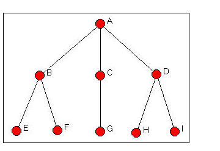
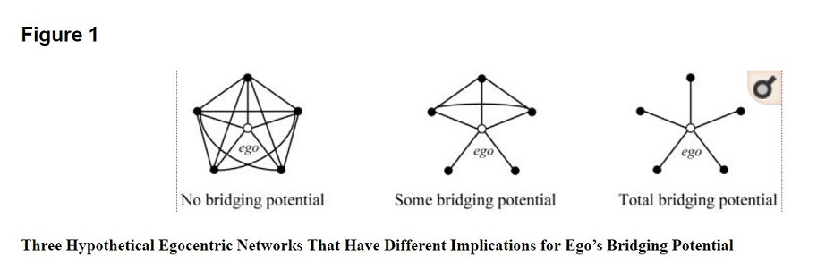

```{r setup, include=FALSE}
knitr::opts_chunk$set(echo = FALSE)
```

## Roles and Positions

The importance of social roles has been core to social science, but typically applies solely to attributes of actors: Mother, Worker, Student and so on.

Structurally, of course, we are interested in roles and positions that emerge from social structure.

*Position*  - “collection of individuals who are similarly embedded in networks of relations” (W&F 348) 
	- actors with similar ties, activity, etc.

*Role* – “refers to the patterns of relations which obtain between actors or between positions” (W&F 348)
- Associations among relations – my bosses boss, my brother’s co-worker
Thus, when we are thinking about roles and positions, we often also want to consider ties and nodes in combination. 


## Roles and Positions
When we are thinking about roles, however, we should not think solely about position within the network, but should consider the fact that actors often assume a variety of roles that can be considered a prelude to action.

 These variety of roles can be captured in several ways: multiple different graphs distinguishing different types of nodes, or different types of ties, or some combination of the two.
Think: muliplexity, multivocality, and so forth.

Thus, when we are thinking about roles and positions, we often also want to consider ties and nodes in combination. 


## Roles and Positions: Equivalence

*Equivalence*: Actors sharing the same positions.

Two Main types of equivalence
*Structural Equivalence*: Exact same position within the graph
*Regular Equivalence*: Same class 

Which are structurally (regularly) equivalent?



## Which nodes are in similar positions: Blockmodels

Most common blockmodels are relaxed forms of structural equivalence and allow us to ask which nodes are in similar positions. This has implications for hierachies and for the distributions of resources, such as information.

The hierarchical aspect has been particularly useful in understanding organziations and the world system.

Igraph doesn't implement blockmodels. So we will use sna package instead.

To begin we load the required packages and the data:

```{r, echo=T, message=F}
library(network)
library(sna)
load("Tutorial.Rdata")
```

## How to Blockmodel

Blockmodeling involves two major steps. 

1. "A partition of actors in the network into discrete subsets called positions."
2. "For exach pair of poasitions a statement of presence or absence of a tie or between positions on each of the relations." (Wasserman and Faust)

After plotting the network in sna, we can use equiv.clust(g) to locate clusters. equiv.clust "computes
the distances between all pairs of positions".

```{r, echo=T, results="hide", fig.show = 'hide'}
plot.network(f, label=get.vertex.attribute(f, "id"))	
fc <- equiv.clust(f, mode="digraph")

plot(fc)
```


## How to Blockmodel

```{r}
plot.network(f, label=get.vertex.attribute(f, "id"))	
```

## How to Blockmodel

```{r}
plot(fc)
```

## How to Blockmodel

After inspecting the dendogram, we can construct our blockmodel with

blockmodel(g, k=[# of Blocks])

```{r, echo=T, results='hide', fig.show = 'hide'}
f.bm2 <- blockmodel(f, fc, k=2)		#looking at it made the 2-solution clear
f.bm2
plot.blockmodel(f.bm2)				# take a look
```

## How to Blockmodel

Plot blocks

```{r}
plot.blockmodel(f.bm2)				# take a look
```


## How to Blockmodel

```{r, echo=T, results='hide', fig.show = 'hide'}

f.bimage <- f.bm2$block.model		# pulling off just the block image
f.bimage
gplot(f.bimage, diag=TRUE) 			# let's plot the image network
plot.sociomatrix(f.bimage)			# the image matrix
```

## How to Blockmodel
Plot image network

```{r}
gplot(f.bimage, diag=TRUE) 			# let's plot the image network
```


## How to Blockmodel
Plot image matrix

```{r}
plot.sociomatrix(f.bimage)			# the image matrix```
```


## How to Blockmodel with Real Data
```{r, echo=T, results="hide", fig.show = 'hide'}
plot.network(valente, displaylabels=T)	
ec <- equiv.clust(valente, mode="graph", method="euclidean", plabels=network.vertex.names(valente)) 	# generating the clusters
#ec											# note the options
plot(ec)									# take a look
```

## How to Blockmodel with Real Data
```{r}
plot(ec)									# take a look
```

## How to Blockmodel with Real Data

```{r, echo=T, results="hide", fig.show = 'hide'}

bm6 <- blockmodel(valente, ec, k=6)			# specifying 6 clusters (worth checking others)
#bm6										# there are a few elements here
plot.blockmodel(bm6)						# take a look
bimage <- bm6$block.model					# pulling off just the block image
```

## How to Blockmodel with Real Data

Plot blockmodel

```{r}

plot.blockmodel(bm6)						# take a look

```


## How to Blockmodel with Real Data
```{r, echo=T, results="hide", fig.show = 'hide'}
gplot(bimage, diag=TRUE, 								# let's plot the image network
	edge.lwd=bimage*5,									# edge-thickness as image-matrix density
	vertex.cex=sqrt(table(bm6$block.membership))/2,		# vertex-size as block size
	vertex.sides=50, label.pos=5, vertex.col="gray",
	label=names(table(bm6$block.membership)))	

```

## How to Blockmodel with Real Data

Plot image network for Valente

```{r}
gplot(bimage, diag=TRUE, 								# let's plot the image network
	edge.lwd=bimage*5,									# edge-thickness as image-matrix density
	vertex.cex=sqrt(table(bm6$block.membership))/2,		# vertex-size as block size
	vertex.sides=50, label.pos=5, vertex.col="gray",
	label=names(table(bm6$block.membership)))	

```


## How to Blockmodel with Real Data

Plot image matrix

```{r}
plot.sociomatrix(bimage)	# the image matrix
```

## How to Blockmodel with Real Data
```{r, echo=T, results="hide", fig.show = 'hide'}


valente %v% "blocks" <- cbind(bm6$plabels, bm6$block.membership)[order(cbind(bm6$plabels, bm6$block.membership)[,1]),][,2]	
plot(valente, vertex.col="blocks", displaylabels=T)	

```

## How to Blockmodel with Real Data

Plot the network with blocks as vertex attribute.

```{r}
valente %v% "blocks" <- cbind(bm6$plabels, bm6$block.membership)[order(cbind(bm6$plabels, bm6$block.membership)[,1]),][,2]	
plot(valente, vertex.col="blocks", displaylabels=T)	

```

##Blockmodel with CONCOR

*CONvergence of iterated CORrelations.*

"Insofar as CONCOR uses correlation as a both a measure of structural equivalence as well as a means of identifying groups of structurally equivalent actors, it is easy to forget that blockmodeling with CONCOR entails the same basic steps as blockmodeling with HCA. The logic behind the two procedures is identical. Indeed, Breiger, Boorman, and Arabie (1975) explicitly describe CONCOR as a hierarchical clustering algorithm. Note, however, that when it comes to measuring structural equivalence, CONCOR relies exclusively on the use of correlation, whereas HCA can be made to work with most common measures of (dis)similarity." - Slez (2015)


```{r, echo=F, message=F}

#devtools::install_github("aslez/concoR")

library (igraph)
ivalente <- read.graph("valente.net", format="pajek")
gender1 <- as.matrix(read.table("valente.clu", skip=1))	
V(ivalente)$gender <- as.vector(gender1)

```


##Blockmodel with CONCOR

```{r, echo=T, message=F}

#devtools::install_github("aslez/concoR")

library(concoR)


mat <- as.matrix(get.adjacency(as.undirected(ivalente)))

m0 <- cor(mat) # Calculate a correlation matrix
round(m0, 2)   # Round the output to 2 significant digits

blks <- concor_hca(list(mat), p = 2) 
blks

```

##Blockmodel with CONCOR

```{r, echo=T, message=F, results="hide", fig.show = 'hide'}

blk_mod <- blockmodel(valente, blks$block) 

blk_mod

plot(blk_mod)

```


##Blockmodel with CONCOR

```{r, echo=F, message=F}

blk_mod <- blockmodel(valente, blks$block) 

blk_mod

plot(blk_mod)

```


##Blockmodel with CONCOR

```{r, echo=T, message=F, fig.show = 'hide'}

V(ivalente)$blocks <- blks$block

plot.igraph(ivalente, vertex.color=V(ivalente)$blocks, edge.arrow.width=.05)

```


##Blockmodel with CONCOR

```{r, echo=F, message=F}

V(ivalente)$blocks <- blks$block

plot.igraph(ivalente, vertex.color=V(ivalente)$blocks, edge.arrow.width=.05)

```


##Weak Ties
"[A]ll bridges are weak ties." 

"The significance of weka ties, then, would be that those which are local bridges create more, and shorter, paths." - Granovetter

"edge betweenness are (roughly) defined by the number of geodesics (shortest paths) going through a vertex or an edge." (Igraph)

```{r, echo=T, results="hide", fig.show = 'hide'}

edge.between <- edge.betweenness(ivalente)

plot.igraph(ivalente, vertex.color=V(ivalente)$blocks, edge.width=edge.between/50, edge.arrow.width=.05)  

detach("package:igraph")

```


##Weak Ties

Plot edge betweenness

```{r, message=F}

library(igraph)

edge.between <- edge.betweenness(ivalente)

plot.igraph(ivalente, vertex.color=V(ivalente)$blocks, edge.width=edge.between/50, edge.arrow.width=.05)  

detach("package:igraph")

```

## Cutpoints

We looked at articulation_points(g) from igraph.

In the sna package, we use cutpoints(g) which has the ability to consider direction and a few other specifications that are not available in igraph.

```{r, echo=T}

load("Tutorial.Rdata")

valente %v% "cutpoints" <- cutpoints(valente, return.indicator=T, mode="graph")

plot(valente, vertex.col="cutpoints", displaylabels=T)	

```


## Brokerage

Gould and Fernandez (1989) present a typology based on triads for brokerage roles. This illustrates the deep connection between theory and methods in networks.


##Brokerage

In SNA, brokerage(graph, group)

```{r, echo=T, message=F, results="hide"}

gender2 <- get.vertex.attribute(valente, "gender")

broker <- brokerage(valente, gender2)

```

## Brokerage

```{r, echo=F, message=F}

print(broker$raw.nli)
```


## Bridging

Goldman and Cornwell (2015:71) define bridging as "the extent to which one maintains social ties to people who are not (or otherwise poorly) connected to each other." 



## Bridging

Triad census in undirected graphs (Davis and Leinhardt 1972). Note the bridge is the "forbidden triad" from Granovetter (1972)


```{r, echo=T}

egos <- ego.extract(valente)

triad.census(egos, mode="graph")

```

##Betweenness

Some have operationalized node betweenness as being associated with structural holes.

```{r, echo=T, messaage=F, results="hide"}

detach("package:sna")
detach("package:network")

library(igraph)


V(ivalente)$between <- betweenness(ivalente)

plot(ivalente, vertex.size=V(ivalente)$between/10, edge.arrow.size=.05)

```

##Betweenness

Plot network with betweenness modeled as node size

```{r}

plot(ivalente, vertex.size=V(ivalente)$between/10, edge.arrow.size=.05)

```

##Constraint
Sum of dyadic constraints where:

Alter j constrains i to the extent that
– i has invested in j
– j has few structural holes
Even if i withdraws from j, everyone else in i’s network is still
invested in j (http://www.analytictech.com/mb874/Papers/Structural%20Holes.pdf)
```{r, echo=T}


V(ivalente)$constraint <- constraint(ivalente)

plot(ivalente, vertex.size=V(ivalente)$constraint*20, edge.arrow.size=.05)

```

##Contraint versus Betweenness


```{r, echo=T, results="hide"}

cor.test(V(ivalente)$constraint, V(ivalente)$between)

becon <- data.frame(name=V(ivalente)$name, constraint=V(ivalente)$constraint, between=V(ivalente)$between)

library(ggplot2)
library(ggrepel)


ggplot(becon, aes(x=between, y=constraint, label=name)) + 
  geom_point() + geom_smooth(method='lm',formula=y~x)


ggplot(becon, aes(x=log(between), y=constraint, label=name)) + 
  geom_point() + geom_smooth(method='lm',formula=y~x)

```

##Contraint versus Betweenness


```{r}


ggplot(becon, aes(x=between, y=constraint, label=name)) + 
  geom_point() + geom_smooth(method='lm',formula=y~x)


```

##Contraint versus Betweenness


```{r}


ggplot(becon, aes(x=log(between), y=constraint, label=name)) + 
  geom_point() + geom_smooth(method='lm',formula=y~x)

```

##Reach Centrailty

Reach centrality captures the proportion of nodes that one can reach in n-steps. Here we look at three. As it is not included in igraph, we include the function from shizukalab.com.

http://www.shizukalab.com/toolkits/sna/node-level-calculations

```{r, echo=T}

reach3<-function(x){
  r=vector(length=vcount(x))
  for (i in 1:vcount(x)){
    n=neighborhood(x,3,nodes=i)
    ni=unlist(n)
    l=length(ni)
    r[i]=(l)/vcount(x)}
  r}

reach3 <- reach3(ivalente)

```

##Reach versus Constraint

```{r, echo=T, results="hide", fig.show="hide"}

cor.test(reach3, V(ivalente)$constraint)

recon <- data.frame(reach=reach3, constraint=V(ivalente)$constraint, name=V(ivalente)$name)

ggplot(recon, aes(x=reach, y=constraint, label=name)) + 
  geom_point() + geom_smooth(method='lm',formula=y~x)

```


##Reach versus Constraint

```{r}

ggplot(recon, aes(x=reach, y=constraint, label=name)) + 
  geom_point() + geom_smooth(method='lm',formula=y~x)

```


##The End

The end.
