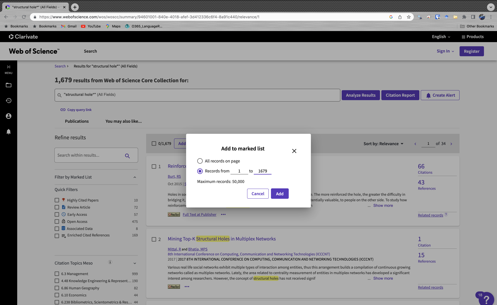
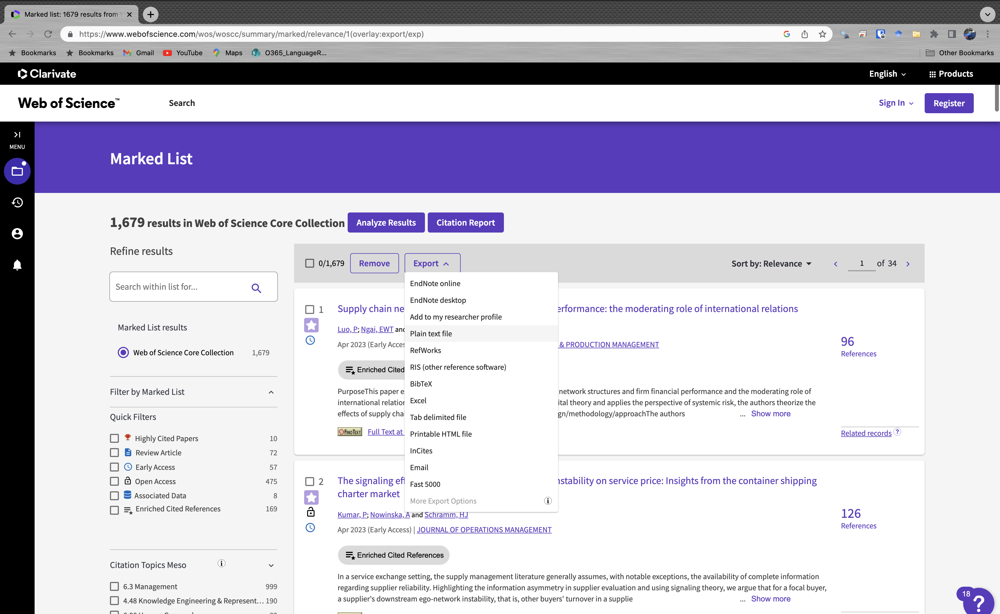
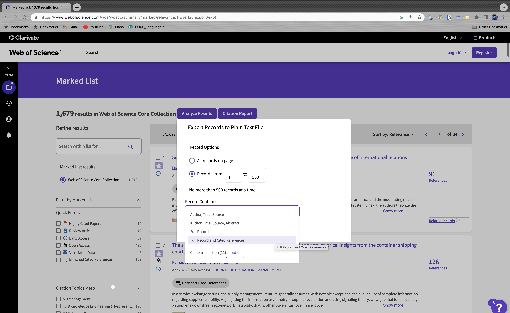

```{r setup, include=FALSE}
knitr::opts_chunk$set(echo = FALSE)
```

How do social actors or entities connect to one another? On its face the answer is obvious: Actors are directly tied to one another through social relations (friends with, talks to, advice from, and so on). But, social scientists for some time have viewed social connectivity more broadly to include how actors connect to one another through indirect ties through co-membership or affiliation (members of the same team, members of the same corporate board, co-authorhip, and so on). As Cooley wrote,  “A man may regarded as the point of intersection of an indefinite number of circles representing social groups, having as many arcs passing through him as there are groups.” 

When we discussion affiliation networks, we ask:

What does it mean to be affiliated through a literal group, activity, or event?
 
And we may also ask: 
 
What does it mean to be connected through a generic group or an abstraction?

It is probably not controversial to claim that people who are in the exact same social group share some type of meaningful connection through being members in the same group. If I attend a book club with you, then I am likely to share numerous characteristics, at minimum a shared appreciation of similar books. However, if we attend book clubs in different cities, does generic book club membership provide a meaningful tie?

Scholars interested in duality and affiliation are interested in these kinds of questions, but they extend to non-human entities as well, like scientific papers or emotions, that can be modeled as two-mode or affiliation networks.

Earlier work on duality (Breiger 1974) builds upon Cooley's idea: People intersect through their associations, which defines (in part) their individuality. The concept of duality recognizes that relations among groups implies relations among individuals or vice versa. 

As Breiger(1974:87) writes, "With respect to the membership network...persons who are actors in one picture (the P matrix) are with equal legitimacy viewed as connections in the dual picture (the G matrix), and conversely for groups."

The resulting network after these transformations:
    - Is always symmetric
    - The diagonal tells you how many groups (persons) a person (group) belongs to (has).

We can see how these types of transformations work by turning to a toy example.

First, we should load the packages that we will need in this workshop. We will use **bibliometrix** for some two mode science network analysis,  **igraph** for network analysis and visualization, **ggraph** for visualization, **udpipe** for some language parsing, and **dplyr**, **tidygraph**, and **ggforce** for a few data organization and visualization tasks. We use **tidytext** and **widyr** for some text processing functions.

```{r, message=FALSE}
library(bibliometrix)
library(igraph)
library(ggraph)
library(udpipe)
library(dplyr)
library(tidygraph)
library(ggforce)
library(tidytext)
library(widyr)
```

## Affiliation Example

Let's begin with a person-to-group matrix
 
Each column is a group, each cell is a person, and the cell=1 if the person in that row belongs to the group in that column. You can calculate how many groups shared between two individuals by comparing the rows. Identify every column where both rows equals 1 and sum them. This is the overlap.


You can also tell the total number of group members by summing the columns and the total number of groups/indvidual by summing the rows.

Let's make a matrix in **R**.

```{r, echo=T}
one <- c(0, 1, 1, 0, 0, 0)
two <- c(0, 0, 1, 1, 0, 0)
three <- c(0, 0, 0, 1, 1, 1)
four <- c(0, 0, 0, 1, 0, 1)
five <- c(1, 0, 0, 1, 0, 0)

dual <- cbind(one, two, three, four, five)

rownames(dual) <- c("A", "B", "C", "D", "E", "F")

print(dual)

```

## Duality, Transformations, Matrix Algebra

Recall that the matrix is a simple and elegant way to manipulate networks. That is most obviously the case, perhaps, when thinking through duality.

From persons-to-groups to persons *and* groups.

If we multiple our Persons-to-Group matrix by its transpose, we have a Person matrix.

If we multiply the transpose of our Persons-to-Group matrix by the matrix itself, we have the Groups matrix.


The Person-Person Matrix:

```{r, echo=T}

person <- dual %*% t(dual)

print(person)

```

The Group-Group Matrix:

```{r, echo=T}

groups <- t(dual) %*% dual

print(groups)

```

## Bipartite Network

The general class of affiliation networks are known as *bipartite* or *two-mode* networks. The matrix transformation described above where we transform the network from two-mode to one-mode is called a *projection*.

One-mode projections, while perhaps more easy to understand, obviously involve a substantial loss of information. 

While it remains more common, perhaps, to project two-mode networks, increasing work is looking at the tractability of keeping two-mode networks as two-modes.

## Science Networks

Science networks have been a major area where duality has been examined. We can think of all of the two-mode networks that structure science: People in labs, departments, etc or ideas in books, articles, etc. From bibliographic records we can construct numerous two-mode networks and project them to one-mode networks if we so choose. We can plot university by article or university by journal networks. We can plot country by keyword networks or typical coauthorship or cocitation networks.

I provide an overview of downloading data in Web of Science [below](#download). We download these data manually at this point and use the **Bibliometrix** package to bring the data into a useable file.

So, we can also start by reading the data into **Bibliometrix**.

### Organize and Analyze Data in **Bibliometrix** {#organize}

First, we need to bring the raw WoS data into a readable file. We can do this with the ``convert2df`` function in **Bibliometrix**. This requires a path for where the raw files are stored. We can grab those paths with the ``list.files`` function and be sure to specify that ``full.names = TRUE`` to grab the entire path.

```{r, echo=T, message=FALSE}

sh.articles <- list.files(path="data/articles/", full.names = TRUE)

sh.df <- convert2df(file=sh.articles, dbsource="isi", format="plaintext")

```

We will return to this data frame for reasons described below. But, it may be worthwhile to build a bibliometrix object and use some of this packages functions. We can use the ``biblioAnalysis`` function to build things and then use ``summary`` and ``plot`` to see an overview of the corpus.

```{r, echo=T, message=FALSE}

sh.biblio <- biblioAnalysis(sh.df, sep=";")

summary(sh.biblio, k=10)

plot(x=sh.biblio, k=5, pause=FALSE)

```

**Bibliometrix** has number useful functions and you can see a good introduction [here](https://www.bibliometrix.org/vignettes/Introduction_to_bibliometrix.html). For example, we can plot the co-authorship network using the ``biblioNetwork`` function on the data frame and specifying ``analysis="collaboration`` and ``network=authors``.

```{r, echo=T, message=FALSE}

coauth <- biblioNetwork(sh.df, analysis="collaboration", network="authors", short=TRUE)
```

And then we can plot using ``networkPlot`` here we also remove isolates and only label the top 10 nodes.

```{r, echo=T, results='hide', message=FALSE}

networkPlot(coauth, remove.isolates=TRUE, label.n=10, cluster="none")

```

We can see that the network contains a small large component and numerous smaller components.

Manipulating the network in **Bibliometrix** isn't always intuitive. So, we can move back and forth between the matrices and data frames conveniently generated by **Bibliometrix** and **igraph** or other packages.

### Co-authorship Network

Let's use the author network as an example. First, let's reduce the size of the corpus to just the look at 1990-2015 using ``filter`` in **dplyr**. Note that PY is the publication year.

```{r, echo=T, message=FALSE}

short <- sh.df %>% filter(PY>1989 & PY<2016)

```

Now we can use the ``cocMatrix`` function in **Bibliometrix** to generate a two-mode article by source matrix by specifying ``field = "AU"``.

```{r, echo=T, message=FALSE}

au.mat <- cocMatrix(short, Field="AU", sep=";")

```

Now we can use ``graph.incidence`` to read the bipartite matrix into an **igraph** object. 

And to project this two mode network into a one mode network, we can use the ``bipartite_projection`` function, where "multiplicity" indicates whether the co-appearances should be added together as an edge weight and where "which" is FALSE is the first mode and TRUE is the second mode. As the the lemma is in the first column, we can choose TRUE here.

```{r, echo=T, message=FALSE}

au.g <- graph.incidence(au.mat)

au1mode.g <- bipartite_projection(au.g, multiplicity = TRUE, which=TRUE)

plot(au1mode.g, vertex.label=NA, vertex.size=4)

```

And we can grab the largest component using the ``components`` function in **igraph** and plot this component and ``induced.subgraphs`` to pull out the component.

```{r, echo=T, message=FALSE}

comps <- components(au1mode.g)

bcomp <- which.max(comps$csize)

keep_ids <- V(au1mode.g)[comps$membership == bcomp]

aucomp.g <- induced.subgraph(graph=au1mode.g, vids=keep_ids)

plot.igraph(aucomp.g, layout=layout_with_kk, vertex.label.cex=.5, vertex.size=5)

```

### Text Networks

Text networks are increasingly common and relatively simple methods for document classification and/or generating thematic relationships across texts.

The goal is data reduction: Take a bunch of texts and simplify the relationship between them and/or their ideas.

Fundamentally, these are bipartite networks consisting of documents and words. We can think of any number of networks in similar ways, such as cocitation networks that consist of documents and citations. 

Steps in processing texts:

    1. Find a collection of texts
    2. Force the collection into a .csv (etc.)
    3. Preprocess the text data
        - Remove stop words and or select POS (e.g. nouns)
        - N-grams?
        - Word length
        - Common words
    4. Build document by word matrix
        - "Bag of words:" Word order doesn't matter
        - Weighted elements?: Common weight is tfidf
    5. Project to terms or documents
    6. Plot

Let's build a text network and a network of documents from the Web of Science on "structural holes."

**Bibliometrix** has some text analysis capabilities, but we may want more flexibility in terms of what counts as text and so on. For example, we can organize and clean the data by deleting articles that don't have an abstract and by combining keywords, titles, and abstracts. 

Next, we can parse the combined text field and tag the words in the field by part-of-speech by using a pos-tagger. In this case, we use **udpipe** by first downloading an English language model using ``udpipe_download_model(language = "english-lines")`` then loading it into our **R** session with the local path using ``udpipe_load_model(file=pathname)``. Last, we use ``udpipe_annotate`` on the text field to tag each word with a part of speech. Here, we also use ``filter`` in **dplyr** to select on nouns, but you may or may not want to look only at nouns.

```{r, echo=T, message=FALSE}

holes <- short %>% filter(AB != "")

holes$text <- paste(holes$DE, holes$TI, holes$AB)

m_eng_lines   <- udpipe_download_model(language = "english-lines")
m_eng_lines_path <- m_eng_lines$file_model
m_eng_lines_loaded <- udpipe_load_model(file=m_eng_lines_path)

text_annotated <- udpipe_annotate(m_eng_lines_loaded, x = holes$text) %>%
      as.data.frame() %>%
      select(-sentence)

nouns <- text_annotated %>% filter(upos=="NOUN")

```

After we select nouns, we can also clean the data in some ways that are typical for text networks, such as getting rid of short words, numbers, and words that appear only a handful of times, here 10 or fewer times. You see that most of these cleaning steps use either **base R** or **dplyr**.

```{r, echo=T, message=FALSE}

nouns$lemma <- tolower(nouns$lemma)

data("stop_words")

nouns <- nouns %>%
  filter(!lemma %in% stop_words$word)

word_count <-as.data.frame(table(nouns$lemma))

word_count <- rename(word_count, lemma = Var1)

word_count$isnum <- nchar(gsub("[^0-9]+", "", word_count$lemma))

word_count <- word_count %>% filter(isnum==0)

word_count$lemma <- as.character(word_count$lemma)

word_count$wlength <- nchar(word_count$lemma)

word_count <- word_count %>% filter(wlength>3)

word_count <- word_count %>% filter(Freq>10)

word_count$keep <- 1

noun_fin <- left_join(nouns, word_count)

noun_fin[is.na(noun_fin)] = 0

noun_fin <- noun_fin %>% filter(keep==1)
```

It is common to adjust the weight of tokens or words by their frequency so very frequent words are penalized. We can use **tidytext** for that.

```{r, echo=T, message=FALSE}
art_nouns <- noun_fin %>%
    count(doc_id, lemma, sort = TRUE)

total_nouns <- art_nouns %>% 
  group_by(doc_id) %>% 
  summarize(total = sum(n))

art_nouns <- left_join(art_nouns, total_nouns)

noun_tf_idf <- art_nouns %>% bind_tf_idf(lemma, doc_id, n)

```

### Structural Hole Text Network

The output of the data cleaning process results in a edge list, if we ``select`` (from **dplyr**) on the lemma - or root word - and the doc_id. We can use ``pairwise_count`` from **widyr** to create a weighted edgelist. If we rename the count variable, "weight" **igraph** will read the network as weighted. To create an igraph object, we can use ``graph_from_data_frame`` on this data frame edge list.

```{r, echo=T, message=FALSE}

noun_edge <- noun_tf_idf %>% select(lemma, doc_id, tf_idf)

noun_pair <- noun_edge %>% pairwise_count(lemma, doc_id, wt=tf_idf)

noun_pair <- rename(noun_pair, weight=n)

noun.g <- graph_from_data_frame(noun_pair)

noun.g <- as.undirected(noun.g)

V(noun.g)$wrd_cnt <- word_count$Freq

noun.g <- delete.vertices(noun.g, V(noun.g)[ degree(noun.g)==0]) 

plot(noun.g, layout=layout_with_kk, vertex.size=V(noun.g)$wrd_cnt/100, main="Structural Holes Noun Network")

```

This is a messy graph, so we can use **ggraph** to clean it up and engage some other editing like using ``delete.edges`` in **igraph** where we use ``quantile`` function to grab the top 10 percent of edges. 

```{r, echo=TRUE, message=FALSE}

n1sub.g <- delete.edges(noun.g, which(E(noun.g)$weight < (quantile(E(noun.g)$weight, .90)
)))

n1sub.g <- delete.vertices(n1sub.g, V(n1sub.g)[ degree(n1sub.g)==0 ]) 

cls_fast <- cluster_fast_greedy(n1sub.g)

membs <- data.frame(clusters=as.numeric(cls_fast$membership))

clrs <- data.frame(clusters=c(1,2,3,4, 5, 6, 7, 8, 9), clr=c("purple", "yellow", "green", "skyblue", "red", "pink", "grey", "tomato", "gold"))

membs <- left_join(membs, clrs)

ggraph(n1sub.g, layout = "kk") + 
  geom_edge_link(alpha=.25, aes(width=weight), color="gray") + 
  geom_node_point(aes(size=wrd_cnt, fill = membs$clr), shape=21) +
  geom_node_text(aes(label=ifelse(wrd_cnt > 100, name, NA))) +
  scale_size_continuous(range = c(2, 20))   +
  theme_void() +
  theme(legend.position = "none") +
  labs(title="Structural Hole Network: 1986-2000", caption = "This graph visualizes the text network for structural holes based on words in the abstract, title, and keywords.
  Nodes are words. Edges are the count of overlaps across articles. Communities using FastGreedy. 
  Node labels are words that appear in at least 100 articles.")
```

## Bonus: How to Download WoS Data {#download}

We download bibliographic data from the Web of Science. We could use other databases that each have their strengths in terms of coverage. WoS is widely viewed as having good coverage of the social sciences. It also plays nicely with **Bibliometrix** which is nice for processing as bringing the data into R can be tricky.

The first step is to access Web of Science. You may have to vpn into the library. You can access the main search page via https://www.webofscience.com/wos/woscc/basic-search. Here, you have some decisions to make. Do you want to search the entire collection or do you want to search specific collections like the Social Sciences Citation Index. You can also run an advanced search. For our purposes we search "structural hole*" in all fields. The asterisk indicates that we want any variation of hole, specifically here "hole" and "holes."


After clicking search, we can see the list of articles that were located in the database. Next, we want to store these as a marked list. If you click "Add to Marked List" without having any articles clicked, you can mark 50,000 at a time.



After clicking add, the marked list is stored in the folder on the right hand navigation menu. If you click on the folder, you will see the marked list. Now, we want to export these files. **Bibliometrix** can convert several types of files to data frames, but we click on the Export button and  choose plain text.



After clicking on the export format, the export records file will appear. This box changes slightly depending on what kind of information that you want. For example, the number of records that you can export changes. We default to capturing the most information - Full Record and Cited References, which reduces the number of records to 500. Export the corpus by changing the numbers in the records box. You can see how this can be quite time consuming.



These records will be stored in your local Downloads folder. I recommend that you move them. Now, we can clean and organize the data in **Bibliometrix** as described [above](#organize).


