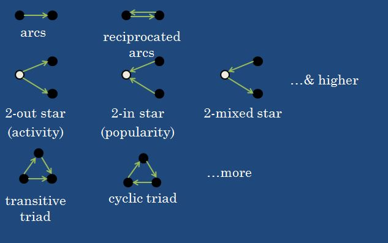
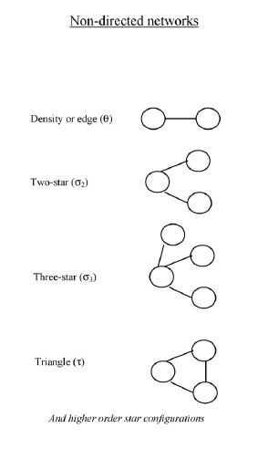
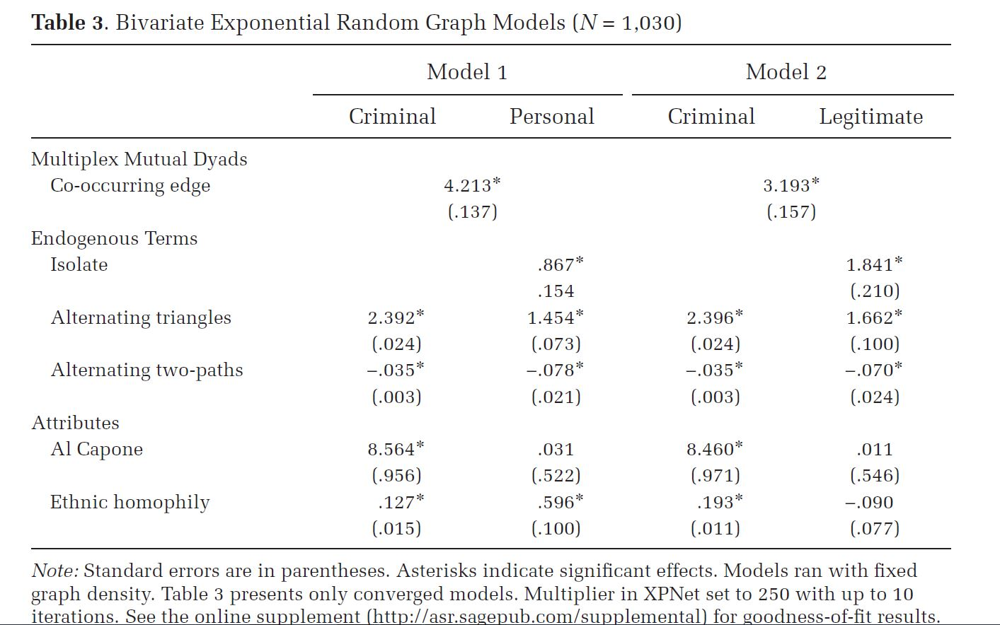

```{r setup, include=FALSE}
knitr::opts_chunk$set(echo = FALSE)
```

## Statistical Approaches to Networks 

We have spent the bulk of this class thinking through approaches to networks that generate network statistics. For example, we have examined how to measure centrality, network clustering, and so forth.

These network statistics prove useful when modeling social processes as independent variables or even dependent variables in canonical regressions (with great care) and are often used as such.

Last week, introduced QAP regression techniques that predict dyadic relationships given a random distribution of simulated networks.

## Statistical Approaches to Networks 

Yet, we may have questions about the network itself. Specifically, we may wonder how a network came about or what processes likely led to a particular network.

Scholars have developed a set of models called "exponential random graph models" or (ERGMs) to address this kind of question.

## The Rise of the Network

The intuition of these models is that networks arise from a set of local network patterns. This makes sense because we assume that large networks are aggregations of smaller network processes.

The network statistics that we've worked with in prior sessions form the generative pieces of these network formation processes.

The local network processes captured by network statistics are called *network configurations*.

A few examples: Degree, Triads, K-stars

"In short, the probability of the network depends on how many of those configurations are present, and the parameters inform us of the importance of each configuration." (Robins and Lusher 2013:9).

## Network Theory

We often use "network theory" in a generic sense: networks matter, relationality matters, etc. ERGMs require a more systematic consideration of network theory and especially factors contributing to a particular network's generation. ERGMs are well-suited for considering multiple explanations or for being "multitheoretical."

Robins and Lusher describe 5 basic theoretical assumptions of ERGMs.

    1. SNs are locally emergent
    2. Network ties self-organize (endogenous dependencies), 
    but also are influenced by actor attributes (exogenous factors)
    3. Patterns indicate on-going processes
    4. Multiple processes can operate simultaneously
    5. SNs are structured, but stochastic.
    
## Typical ERGM characteristics

    - Most common to model the *observed* network (i.e. the data at hand)
    - ERGMs are often binary
    - ERGMs can be directed or undirected
    - Tie weights can be incorporated as an exogenous factor
    - ERGMs are often cross-sectional, but recent attention to time variant 
    networks (e.g. tergms)

## Network Configurations

Network configuration: "[A] possible small subgraph that may represent a local regularity in social network structure."



## Configurations and Attributes

Undirected configurations from Robins et al. (2007)



## Logic/History of ERGMs

Intuition: Network dependencies mean that standard forms of statistical analysis may be inappropriate.

Early network scientists compared observed network to null distribution. We still can use random graphs to infer network properties, but tie dependency isn't addressed.

Approaches based on Bernoulli random graphs were an important part of this history (see Frank 1981). These models draw attention to the ties in a graph relative to a random distribution, but ties remain independent.

## Logic/History of ERGMs

Dyadic models (e.g. p1 models) turn from edges to dyads and therefore configurations include both edges and reciprocity and even in-/out-degree, but dyads remain independent.

These models are limiting as they don't properly account for network contingency. Frank and Strauss(1986) introduced Markov dependence, "in which a possible tie from i to j is assumed to be contingent on any other possible tie involving i or j, even if the status if other ties in the network is known" (Robins and Lusher 2007:182).

## ERG Model

ERGMs take the form of a probability distribution of graphs:


    
-$Y$: [Yij] i.e., a system fo tie variables

-$y$: realization of Y or the observed network

-$z(y)$: is a vector of network configurations

-$\theta$ : a parameter vector corresponding to z(y)

-$\kappa(\theta)$: is a normalizing factor making p sum to 1 or making sure that 
    we have a "proper probability distribution"

## ERG Model

Note: Initial ERGMs relied on pseudo-likelihood estimation, but this proved flawed and now it is most common to use MCMCMLE, which essentially simulates many networks and refining parameter values against the observed graph.

Note: *Degeneracy* results in models that fail to converge. These models don't perform well on highly clustered data and indicates that the model is not well-specified.

Note: "All parameters estimated in an ERGM are interdependent, and interpretation of the final estimates is conditional on all other terms included in the model" (Smith and Papachristos 2016)

Note: Positive parameters: More than Random/Negative parameters: Lower than random

## ERGMs in R

The functions for ergms in statnet are similar to canonical models in R.

model < - ergm(g ~ endogenous.factors + exogenous.factors)

Most models start with edges, which is analogous to an intercept and build from there.

model < - ergm(g ~ edges)

## ERGMs in R: Endogenous Terms

Endogenous terms are options available from R and include:

- mutual - edges are reciprocated
- degree
- triangles
- gwesp - (Geometrically-Weigthed Edgewise Partnerships) is a common measure
of triad closure.

## ERGMs in R: Exogneous Terms

Exogenous terms can also be included:

-Race, Gender, Etc.

But also indexed to nodes:

- nodematch - nodes match on variable
- absdiff - absolute difference between two nodes on given attribute

## ERGMs in R: Goodness of Fit

Does the model "fit" the data or how well does the model reproduce global graph properties?

Use a network statistic that is not in the model to compare observed value to distribution of values in the simulated networks:

gof(model, statistic)

## ERGMs in R: Things Fall Apart

ERGMs are notoriously finicky models and are subject to errors. The main issues are degeneracy and resulting failure to converge. 

Degeneracy is when the model parameters are too different from simulated networks and the model isn't a good representation of the data. The error identifies a problem with initial parameter selection. Triangles in particular solve a problem here. This is the trial and error that is suggested in Smith and Papachristos (2016).

## Capone ERGM



